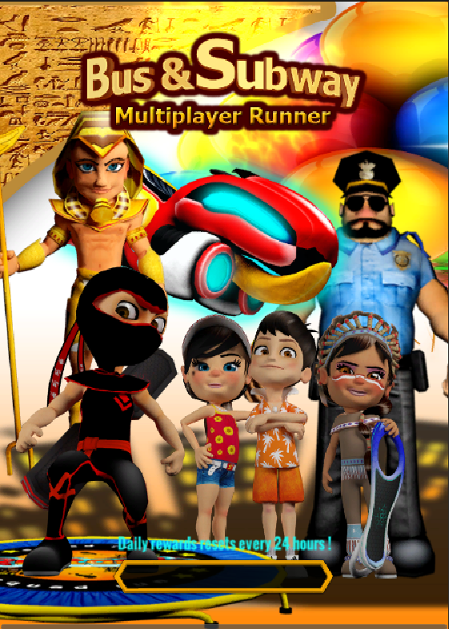
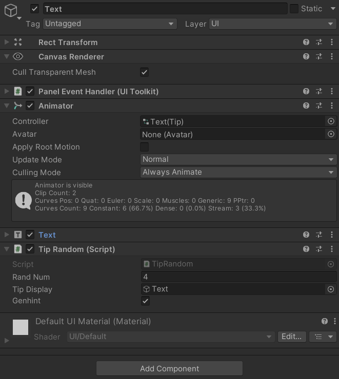
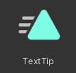
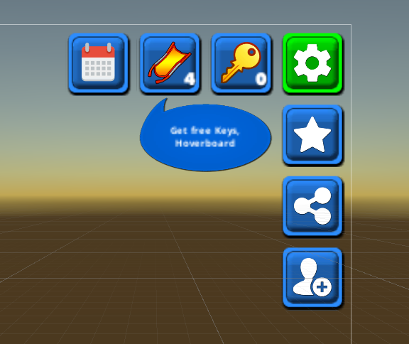
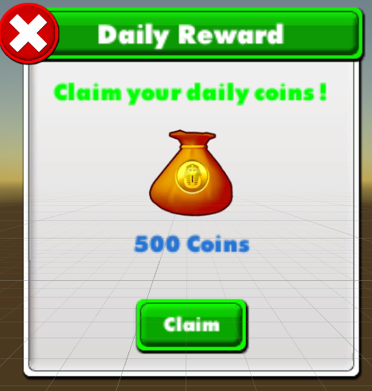

#### Random tips for players on beginning loading screen
+ Providing a small tip for player at the beginning
+ Currently include 4 permanent tips that generate randomly each time you boot up the game
+ Include some animations

+ The tips randomly generate using the TipRandom.cs file :
    - `public class TipRandom : MonoBehaviour`
+ In TipRandom we have an Enumerator function to display different tips:
    - `IEnumerator tipTracker(){
        while(true){
        randNum = Random.Range(1,4);
        if(randNum ==1){
            tipDisplay.GetComponentInChildren<Text>().text = " Remember to upgrade your items !";
        }
        if(randNum ==2){
            tipDisplay.GetComponentInChildren<Text>().text = " Daily rewards resets every 24 hours !";
        }
        if(randNum ==3){
            tipDisplay.GetComponentInChildren<Text>().text = " There are secret areas filled with treasures !";
        }
        if(randNum ==4){
            tipDisplay.GetComponentInChildren<Text>().text = " If you trip twice , the officer will catch up to you !";
        }
        tipDisplay.GetComponent<Animator>().Play("Tips");
        yield return new WaitForSeconds(6);
        genhint = false;
        }
        `
    + When we begin this coroutine, Unity display the randomized number in the inspector and the tip in the UI with the Text GameObject.
    
+ When displaying the tip, an animation will play every 60 frames, simply appearing and disappearing.
+ The animation is stored in TextTip.anim
    
#### Daily Reward system
+ You can receive a 500 coins reward every 24 hours in real time
+ Added new button to receive daily reward : 

+ Daily reward panel :

+ After claiming reward , the claim button turns gray and cannot be clicked until time limit ends.
+ 

